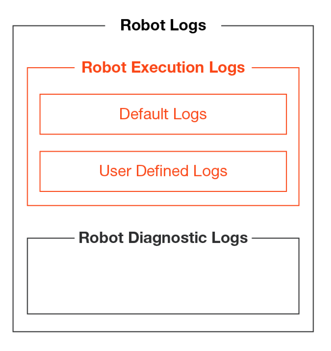

# logging

## Types of logs
- Studio logs
- setup logs
- orchestrator logs
- robot logs

## Robot logs
There are two types of Robot logs:
- **Robot execution logs**: These are messages generated by the execution of a process and contain information related to its behavior and user-defined messages.
- **Robot Diagnostics log**: These provide information related to the Robot itself and its context

Robot execution logs can either be **default logs** or **user-defined logs.**

**Default logs** are generated automatically when certain events take place. These events can be the start/end of a process or a transaction, encountering and error, or when the Robot Logging Setting is set to Verbose.

## Accessing logs
There are several places where you can access Robot Execution Logs:
- In the **Output Panel** in UiPath Studio for the previous process execution from Studio.
- In the **%localappdata%\UiPath\Logs\<shortdata>_Execution.log file** for all processes ran on the machine from UiPath Studio. Logs are generated at Trace level and above or Verbose level and above depending on whether the Verbose level is activated or not.
- In the **%localappdata%\UiPath\Logs\<shortdata>_Execution.log file** for all processes ran on the machine from UiPath Assistant. The logs are generated at the level defined in Uipath Assistant and above.
- In **Orchestrator**, in the Logs section when running processes while connected to Orchestrator. The logs are generated at the defind level and above.

## Logging levels in UiPath
the severity of log level is shown below in descending order
- Fatal/Critical
- Error
- Warning
- Information
- Trace
- Debugging/Verbose level

