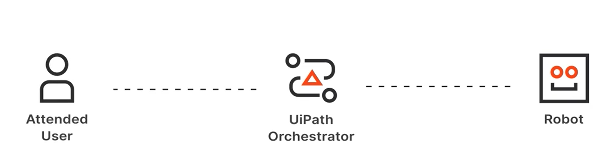
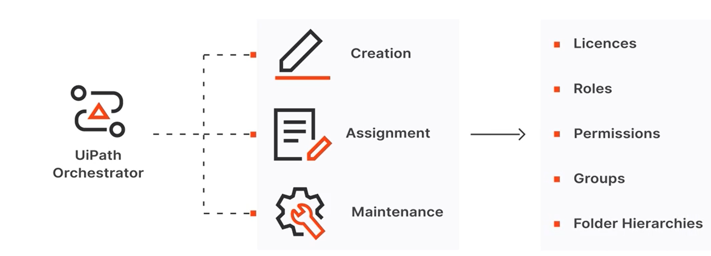
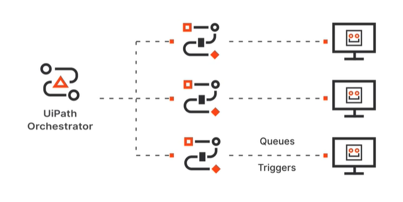
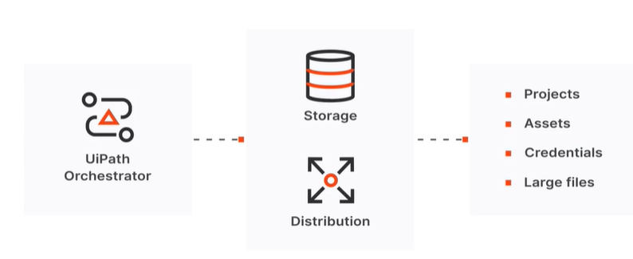
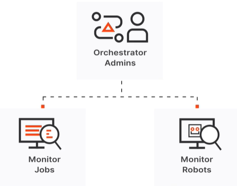
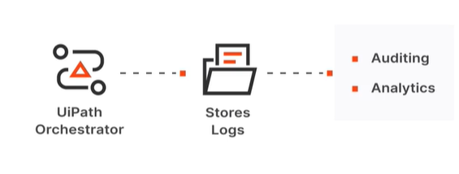
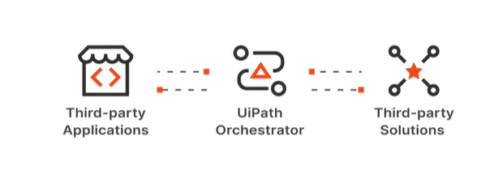

# Orchestrator
## overview
Orchestrator is the component of the UiPath Platform for managing automations, robots, and the related entities.

## The main capabilities of Orchestrator
### Orchestrator Capabilities: Provisioning
Provisioning: Orchestrator creates and maintains the connection with robots and attended users.

### Orchestrator Capabilities: Control and License Distribution

Orchestrator also enables the creation, assignment, and maintenance of licenses, roles, permissions, groups, and folder hierarchies

### Orchestrator Capabilities: Running Jobs in Unattended Mode

it enabels the creation and distribution of automation jobs in various ways, including through queues and triggers.

### Orchestrator Capabilities: Automation Storage and Distribution

Orchestrator is the environment enabling the controlled storage and distribution of automation projects, assets, and credentials, as well as large files used in the automation.

### Orchestrator Capabilities: Monitoring

With Orchestrator, admins are able to monitor jobs and robots.

it also stores Logs for auditing and analytics

### Orchestrator Capabilities: Inter-connectivity

Orchestrator acts as the centralized point of communication for third-party solutions or third-party applications.

## Orchestrator entities-Tenants and Folders

### overview
A single Orchestrator instance can be split into multiple Tenants. Each tenant in an organization can be further subdivided and organized into Folders. 

Folders provide isolation at the resource level, while tenants provide isolation at the organizational level.

## Tenant entities
Robots are tenant entities. This means that they can be allocated to multiple folders in that tenant. Using roles and permissions, the way robots work with each of the folders can be customized.

Packages are published to Orchestrator using feeds. The feeds can be configured to be at tenant level, or at folder level. 

### User entities
Both human users and robots are uniquely identified with user in Orchestrator.

The level of access and the actions that your users can perform is controlled using two elements:
- accounts, which establish the identify of a user and are used to log in to your UiPath applications
- roles, which are assigned to accounts in order to grant them certain permissions within the UiPath ecosystem.

### Machine entities
These are Orchestrator entities corresponding to the workstations where human users and robots work, Using API keys, they enable the connection between the physical or virtual machines and Orchestrator.

### License entities
The right to use Studio and/or Robots, both attended and unattended, is done through licenses. Licenses exist at tenant level, from where they get distributed to users, and consumed when the machines connect to Orchestrator.

### Webhook entites
It facilitate the communication between Orchestrator and other applicatons at API level. These are mapped at tenant level, which means they cannot be differentiated between foleders and will provide information for the entrie tenant.

## Folder entites
A folder is a storage area that helps keep your projects separate. From the entities defined at the beginning of the lesson, processes and jobs are folder entities. Packages depend on feed configuration.

